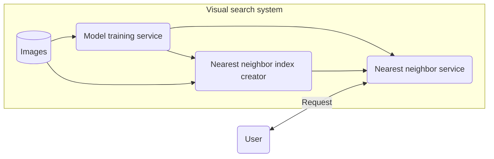

# Visual-search system

This repository is an example implementation of a visual search system. That is, given an input image, find K closest images within an embedding space.

The example is inspired by the system described in the book "Machine Learning System Design Interview", Chapter 2.

## System overview

Below is an overview of this visual-search system:

